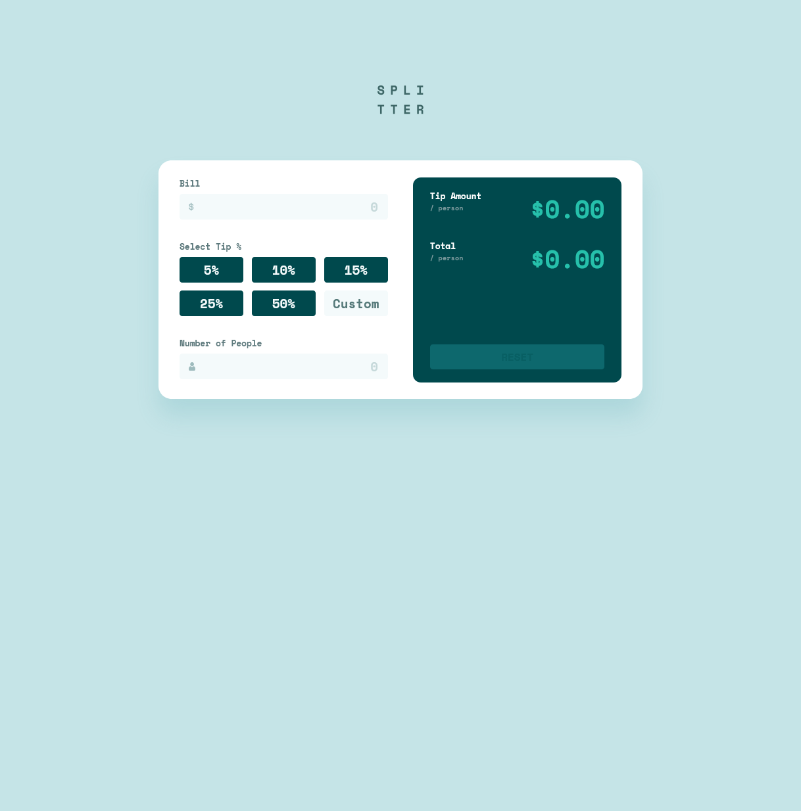

# Frontend Mentor - Tip calculator app solution

This is a solution to the [Tip calculator app challenge on Frontend Mentor](https://www.frontendmentor.io/challenges/tip-calculator-app-ugJNGbJUX). Frontend Mentor challenges help you improve your coding skills by building realistic projects.

## Table of contents

- [Overview](#overview)
  - [The challenge](#the-challenge)
  - [Screenshot](#screenshot)
  - [Links](#links)
- [My process](#my-process)
  - [Built with](#built-with)
  - [What I learned](#what-i-learned)
  - [Continued development](#continued-development)
- [Author](#author)

## Overview

### The challenge

Users should be able to:

- View the optimal layout for the app depending on their device's screen size
- See hover states for all interactive elements on the page
- Calculate the correct tip and total cost of the bill per person

### Screenshot

### Links

- Solution URL: [https://github.com/Leonardo76/tip-calculator-app.git](https://github.com/Leonardo76/tip-calculator-app.git)
- Live Site URL: [https://tip-calculatorfm.netlify.app](https://tip-calculatorfm.netlify.app)

## My process

### Built with

- Semantic HTML5 markup
- CSS custom properties
- Flexbox
- CSS Grid
- Mobile-first workflow
- [React](https://reactjs.org/) - JS library
- [Redux Toolkit](https://redux-toolkit.js.org)

### What I learned

Some more Redux Toolkit (RTK) and React (useEffectEvent)

### Continued development

I will continue updating my knowledge regarding React, RTK, Zustand etc. 

## Author

- Frontend Mentor - [@Leonardo76](https://www.frontendmentor.io/profile/Leonardo76)